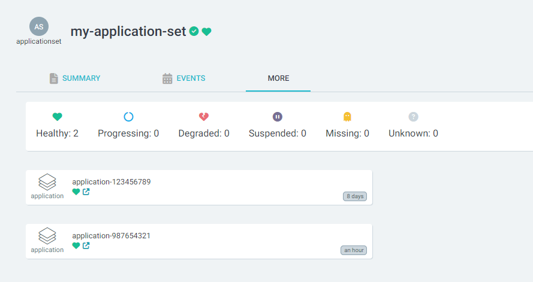

# Application set extension

An extension to use with Applicationset in order to easily identify the number applications and their status

## Install

You need to setup the [ArgoCD Extension Controller](https://github.com/argoproj-labs/argocd-extensions)

Then to install:

- `kubectl apply -f manifests/extensions.yaml`
- Install the apps of applicationset `kubectl apply -f manifests/apps-of-appset.yaml`